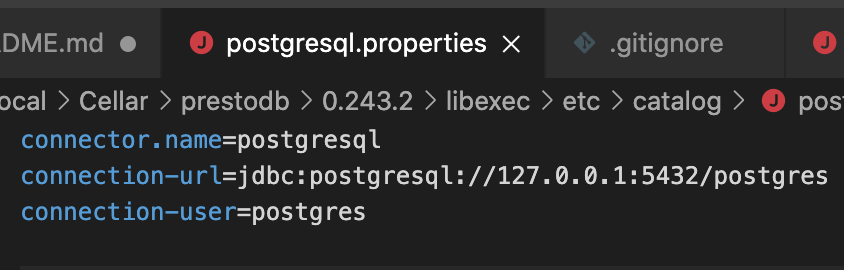

# presto_test
Learning Presto. Test with local csv and sqlite database


### Create new environment
```sh
$ conda create -n presto python=3.7 

$ conda activate presto
```

## Installation  

Dependency to install Presto is only Java 8+
```sh
$ brew install presto
```
Start Presto
```sh
$ presto-server start
```
Check Server Status
```sh
$ presto-server status
```
Restart Presto 
```sh
$ presto-server restart
```
To access web UI go to:  
http://localhost:8080

<br/>

New dataset configration        |  postgresql settings     |  mysql settings 
:-------------------------:|:-------------------------:|:-------------------------:
  |   |  |


Start Presto CLI
```sh
$ presto
```
Start Presto CLI debug mode on
```sh
$ presto --debug
```


### Install Jupyter notebook
```sh
$ conda install -c anaconda ipykernel
$ conda install -c conda-forge notebook
```

<br/><br/><br/><br/>

## Possible issues
* If your server is running only around 10 seconds most probably about plugins. Suggest not to touch custom plugins if you really don't need. Best solution is to reinstall presto using:
```sh
$ brew reinstall presto
```
It will take a few seconds if presto file is already downloaded before.

* If you don't see your virtual environment on kernel list when using jupyter notebook try:
```sh
$ python -m ipykernel install --user --name=presto
$ pip install presto-python-client
```
______________


<br/><br/>


______________


<br/><br/><br/><br/><br/><br/><br/><br/><br/><br/><br/><br/><br/><br/>


______________

### Install requirements
```Python
pip install -r requirements.txt
```

### Create requirements.txt file
```
pip freeze > requirements.txt
```
______________


### Presto CLI commands
 Show catalogs (databases)  
 $ show catalogs;


## install maven

$ conda install -c conda-forge maven

